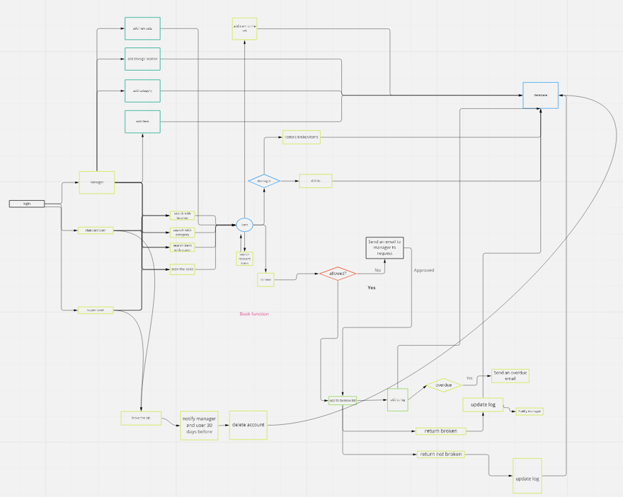
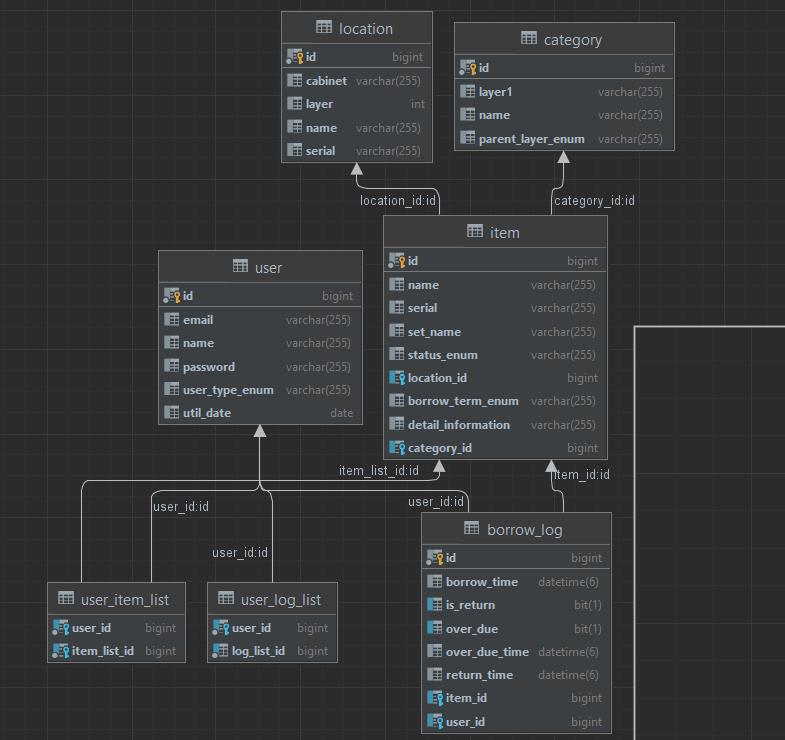

# Equipment

#### Description
This is the frontend of a lab management system for the Dynamics Lab

#### Software Architecture
This project uses the springboot framework which provides a comprehensive programming and configuration model for modern Java-based enterprise applications - on any kind of deployment platform. It uses Maven as the software project management tool. It is a domain driven design project. Currently is has a website version and an Android App version.

#### Business Flowchart

#### Installation
1.	Download Docker desktop https://www.docker.com/products/docker-desktop/
2.	Download jdk 17.0.2^  https://www.oracle.com/java/technologies/downloads/
3.	In command terminal:
      docker search mysql
      docker pull mysql:8.0.24
      docker images
      docker run --name mysql_name -v d:/mysql/data:/var/lib/mysql -p 3306:3306 -d
      docker ps -a

open the docker desktop and go to Containers/Apps to run mysql8
4.	download and run the executable file dynamicslab-0.0.1-SNAPSHOT.jar
5.	Use command terminal: java -jar dynamicslab-0.0.1-SNAPSHOT.jar

#### Instructions

1.	Login and Register
      •	Will alert if missing information
      •	Will alert if registration is complete
      •	Register will only create standard users
2.	My Center
      •	The cookie carries user information, log out and closing the page will clear the personal data

3.	My Borrow List
      •	Will load the borrow list
      •	Report damage will alert to remind user to return the item
      •	Overdue items will be marked with a red ‘Overdue’
      •	Need to scan the return code before returning, this is to make sure the user goes to the lab when returning any item
4.	Home Page
      •	Allow user to search by name or category
      •	Please note that the design is changed, shown in Powerpoint
5.	Add item
      •	Click the check button on Location before submitting the form, this will check if the location exists and get the location id from serial number (please do this or the system will not save the item).
      •	If some detailed information is necessary for looking for the item, like the degree of precision. Please add it to the name section in a bracket as the detailed information is not a selection category.
      •	If you want to add another exact same item, just click the replicate button and it will lead to a new page where all the information will be kept the same, you just need to change the serial number for the identity.

6.	Add Location
      •	Will alert if a location is added
      •	If the location only has one layer E.g., Workbench 1, put in Name: Workbench 1, Layer 0, Cabinet: Workbench 1

7.	Add Category
      •	To add a category, we need the main category, sub-category, and sub-sub-category, where the items are under the sub-sub-categories. For tools, the sub-category and sub-sub-category should be kept the same or the searching function depending on categories will not work.

8.	Item Page
      •	The link to it has the id information
      •	‘Find set’ expands the list with items in the same set
      •	Restore item will set the item status to Available
9.	  Update Item
        •	Stores the previous values so it will be more convenient to change
10.	Duplicate Item Page
       •	Makes it more practical for adding large quantities of items.
11.	  Reminding Email
         •	Overdue items (to user)
         •	Leaving (to user)
         •	User leaving (user detail, items he/she borrows, leaving time) (to manager)
         •	Item broken (to manager)
12.	  Manager page
         •	Can view all the damaged items
         •	Can view all overdue items
         •	Can search a user with name
         •	Can search user with user type
13.	  Export Database to Excel
         Link: https://dev.mysql.com/doc/workbench/en/wb-admin-export-import-management.html
         •	Open MySQL Workbench  
         •	Right click on the table and choose ‘Table Data Export Wizard’
         •	Select the columns you want to export, path you want to export to, click ‘Export to local machine’, and next

14.    Location and Category (Update)
       •	Electronics are divided into four different categories in the main category parts, Electronics acquisition, Electronics Actuation, Electronics workshop, and Electronics Computer and Other
       •	To add a category, we need the main category, sub-category, and sub-sub-category, where the items are under the sub-sub-categories. For tools, the sub-category and sub-sub-category should be kept the same.
       For a more detailed explanation, please see Appendix A

#### Contribution

1.	The project used Spring Boot, React, Java, TypeScript, minor JavaScript, css and html.
2.	Fork the repositories from
      https://github.com/ylinbel/equipment
      https://github.com/ylinbel/equipment_ui

3.	Create a new branch

#### Future Improvement

##### Functionalities
1. Improve the searching function, implement an extendable list for everything based on category
2. Implement a download database function inside the manager page.
3. After 6-months or a year of use, implement an analytical function. Consider time, damage rate, machine lifespan, overdue rate.
4. With the analytical function, adjust the borrow time allowance for some items.
5. Add a log for damaged items, probably with the time until the most recent damage, number of usage, cost of fixing or replacing, so that the manager use it as a reference in the future.

##### System

1. Adjust or expend the database storage, probably need to create more index.

2. If necessary, back up the database to public cloud so that it can be use for other future purposes.

3. Finish the ios app version.

#### Database Design

